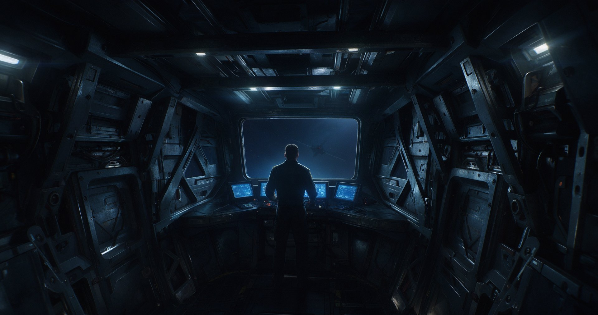

# 星海舵手 · Starsea Helm

> 第一人称舰桥据点防守 + 波次生存。**你只有一面舷窗 —— 前方的。**
> 其余五面是实心舱壁，所以「谁在后面打我」你必须靠监控屏和耳朵判断。

<p align="center">
  
  <br>
  <em>概念占位图（AI 生成）。工程里目前还没有正式美术，这就是我们要做到的样子。</em>
</p>

---

## 这是什么

一款 Godot 4 制作的 3D 第一人称太空舰桥游戏。你不开船、不跑图 —— **你坐在舰桥里当舰长**，
用四个动词打完一整局：装配 / 接管 / 扫视。

| | |
|---|---|
| **品类** | 舰桥据点防守 + 波次生存（不是塔防，不是 FPS） |
| **核心循环** | 装配 → 战斗 → **调整装配** → 战斗 |
| **单位** | **危机**（不是「一局」） |
| **渲染** | Godot 4.7 · Forward+ (Vulkan) |

### 三件让这个项目不一样的事

1. **微创新：只有艏部一面舷窗。**
   信息不对称不是靠 UI 限制做出来的，是**物理保证**的 —— 转头只能看到墙。
   控制台上常驻四路副炮实时画面（低清低帧），放在你平视舷窗时的**下视野余光**里，
   你不必转头背对战场也能读到态势。

2. **失败模式不是「玩家不动手」，是「决策无意义」。**
   战斗刻意低 APM，挂机感是**设计目标**而不是缺陷。
   判据很硬：认真装配和随机装配，存活危机数的差距必须 ≥ 3。差不到，就是设计坏了。

3. **没有货币，没有商店。**
   新炮型和新槽位随危机进度**自动解锁**，解锁节奏咬合威胁曲线。
   你的资源不是钱，是**战损** —— 上一波哪一面被打烂了，就决定了这一波怎么装配。

---

## 当前进度

P0 = 不做就不是这个游戏。现在 P0 只剩两项：

| 状态 | 内容 |
|---|---|
| ✅ 完成 | 白盒舰桥 / 六扇区与威胁计算 / 主炮 + 四向副炮 / 手动接管提速 / 炮塔耐久与全毁判定 / 波次调度 / 监控 feed / 改装阶段 / 自动解锁 / 战损报告 / 陷落演出 / 音频骨架 / 手感第一层（闪白 · 震屏 · 推镜 · 血量反馈） |
| 🟡 进行中 | 手感第五层（VFX）· hitstop |
| ⏸ 冻结 | 监控屏接真实副炮视角 —— 等美术模型到位，与 3D 演出版一起解锁 |
| ⬜ 下一件 | **美术资产方案** —— 替换顺序：舱室 → 控制台 → 敌人 → 炮塔 → VFX |

> 完整清单见 [`docs/BACKLOG.md`](docs/BACKLOG.md)（P0/P1/P2/P3 四级）。

---

## 这个项目是怎么做的

代码仓库本身不太能说明什么 —— 任何人都能让 AI 生成一个 Godot 项目。
**这个项目真正在做的实验是：能不能用一套工程纪律，把 AI 从一个「代码生成器」变成一个「可问责的协作方」。**

### 三轮对话节奏

大多数 AI 协作失败，都是因为跳过了第一轮就直接要代码。

| 轮次 | 人做什么 | AI 做什么 | 禁止 |
|---|---|---|---|
| **第一轮** | 说清任务 | **只复述理解 + 给方案** | ❌ 不许写代码 |
| **第二轮** | **只回答 AI 提的疑问** | 确认方案细节 | ❌ 不许追加新想法 |
| **第三轮** | 说「开始实现」 | 实现 + 自测 | ❌ 不许中途改需求 |

### 五条不可违反的铁律

1. **不写 Bible 就用不了 AI** —— 改了设计必须回填文档。
2. **先让 AI 说方案，再让它写代码。**
3. **一次只改一件事**，改完自测再改下一件。
4. **参数外置到 JSON，AI 只给「旋钮」不给「数值」。**
5. **AI 帮你排优先级，但拍板在人类。**

### 决策登记制

每个设计决策都有编号、有理由、**并且写明「被推翻的条件」** ——
见 [`docs/bible/99_decisions.md`](docs/bible/99_decisions.md)。几个例子：

| 编号 | 决策 | 为什么 |
|---|---|---|
| DEC-026 | 舰桥只有艏部一面舷窗 | 若四面玻璃，玩家转头直接看后面 → 监控失去意义 → 微创新崩塌 |
| DEC-021 | 失败模式 = 决策无意义 | 低 APM 是目标；防的是「认真装配和随机装配没区别」 |
| DEC-025 | 单位尺度由约束反推，不是拍脑袋 | 舷窗视野角是几何算出来的，不是手调的参数 |
| DEC-033 | 无货币 / 自动解锁 | 资源是战损，不是钱 |
| DEC-047 | 手感走「事件 → 强度表」 | 自动火力每帧都在打，全命中都给反馈 = 持续抽搐 |

**这张表是 AI 写不出来的东西** —— 它记录的是人在哪一步拍了板、为什么、以及在什么条件下这个结论会失效。

### 数值只给旋钮，不给终值

所有可调数值外置在 [`data/`](data/)（6 份 JSON）：`presentation.json`（呈现与手感）、`enemies.json`、
`turrets.json`、`waves.json`、`refit.json`、`audio.json`。
改手感、改难度、改音效**不用碰一行代码**。

---

## 工程证据

### 测试：11 套 headless 场景 / 408 条断言，全绿

全部可无头运行，不依赖美术资源。

| 套件 | 覆盖 | 断言 |
|---|---|---:|
| `feel_test` | 手感旋钮 / 推镜精确归位 / 震屏不超上限 / 闪白冷却 | 49 |
| `audio_test` | 总线层级 / 缺素材回退合成音 / 限流键含扇区 / 听觉 HUD | 60 |
| `healthbar_test` | 血量真源 / 层号 / 变暗不吃闪白 / 血条换目标 | 43 |
| `unlock_test` | 开局锁定 / 按危机解锁 / 空槽装炮 | 77 |
| `damage_test` | 战损累计 / 按敌类分解 / 扇区汇总 / 四出口同源 | 37 |
| `refit_test` | 改装阶段机 / 换装真生效 / 隐形跳过 / 未知型号拒绝 | 33 |
| `turret_hp_test` | 伤害路由 / 被毁停火 / 全毁事件 / 死炮不可接管 | 30 |
| `wave_test` | 难度曲线 / 开波生成 / 清空回 REFIT / RESULT 归零 | 25 |
| `turret_round2` | 四副炮独立开火 / 炮位推导 / 端到端击杀 | 21 |
| `collapse_test` | 陷落三级演出 / 夺操控进 RESULT / 表现层容错 | 18 |
| `enemy_test` | 敌人生成 / 移动 / 扇区归属 / 攻击最近炮塔 | 15 |
| **合计** | | **408** |

```bash
# 单跑（需要已导入的工程，即存在 .godot/）
godot --headless --path . res://scenes/tests/feel_test.tscn

# 全套
for s in feel_test audio_test healthbar_test turret_round2 turret_hp_test \
         enemy_test wave_test refit_test unlock_test damage_test collapse_test; do
  printf "%-16s " "$s"
  godot --headless --path . "res://scenes/tests/$s.tscn" 2>&1 | grep -E "断言:|结果：" | head -1
done
```

> headless 下主场景会固定刷一条 `texture_2d_get: Parameter "t" is null` ——
> 那是 dummy 渲染驱动下 `SubViewport.get_texture()` 后端 RID 为 null 的固有限制，**不是你的改动引起的**。

### 三条工程纪律（都有工具兜底，不靠自觉）

- **改完必须实跑确认** —— 不许凭「我以为改了」报成功。渲染 / feed 类问题一律**像素采样**实测，不靠目视。
- **测试走真实调用路径，不抄近路** —— 伤害调 `Turret.take_damage` 而不是直接 `emit`。直接 `emit` 会跳过 `source_id` 传递，**坏了也是绿的**。
- **跨阶段必须清场** —— 不等 `call_deferred queue_free` 落地就数敌人，会把上一波的尸体算进来。

---

## 仓库结构

```
scripts/     35 个 GDScript（约 10,400 行）—— 含 systems/ 与 tests/ 下的 headless 探针
scenes/      14 个场景 · bridge/ 是主场景，tests/ 里是测试场景
data/        6 份外置数值 JSON —— 只给旋钮，不给终值
docs/        bible/（宪法式约束 + DEC 决策登记）与开发指导
.workbuddy/  AI 协作记忆：逐日大事记 / 决策链 / 踩坑记录
```

### 关于 `.workbuddy/`

这个目录是**故意放进仓库的**。

它装着 AI 的逐日工作记录、踩过的坑、以及每一步的决策链 —— 也就是「AI 协作」这件事在代码里看不见的那部分。
如果你想知道「AI 到底是怎么参与这个项目的」，从
[`.workbuddy/memory/history.md`](.workbuddy/memory/history.md) 读起。

---

## 跑起来

```bash
git clone https://github.com/Lijiahong77/Starsea-Helm.git
```

用 **Godot 4.7**（`.NET` 以外的标准版）打开 `project.godot` 即可。
工程路径**含空格**（`Starsea Helm`）—— 如果 MCP 工具链出问题，先排查是不是空格导致的。

> ⚠ 当前是**开发中状态**：白盒场景，美术资源尚未替换，`assets/` 基本是空的。
> 大部分内容需要靠 headless 测试套件验证，不是打开就能玩。

---

## 文档导航

| 想了解 | 读这个 |
|---|---|
| 游戏是什么 / 不是什么 | [`docs/SPEC.md`](docs/SPEC.md) |
| 功能清单与优先级 | [`docs/BACKLOG.md`](docs/BACKLOG.md) |
| 设计决策与理由 | [`docs/bible/99_decisions.md`](docs/bible/99_decisions.md) |
| 系统模块划分 | [`docs/MODULES.md`](docs/MODULES.md) |
| 三个核心文档怎么用 | [`docs/bible/_index.md`](docs/bible/_index.md) |
| 开发流程与协作铁律 | [`docs/PROCESS.md`](docs/PROCESS.md) |
| AI 协作的逐日记录 | [`.workbuddy/memory/history.md`](.workbuddy/memory/history.md) |

---

## 说明

- 这是一个**个人独立开发的实验项目**，License 为 **All Rights Reserved（保留所有权利）**：
  允许阅读与克隆学习，**不允许再分发、商用、修改后发布，或用于训练 AI 模型**。详见 [`LICENSE`](LICENSE)。
- 概念图由 AI 生成（豆包），仅作视觉方向占位，非游戏内截图。
